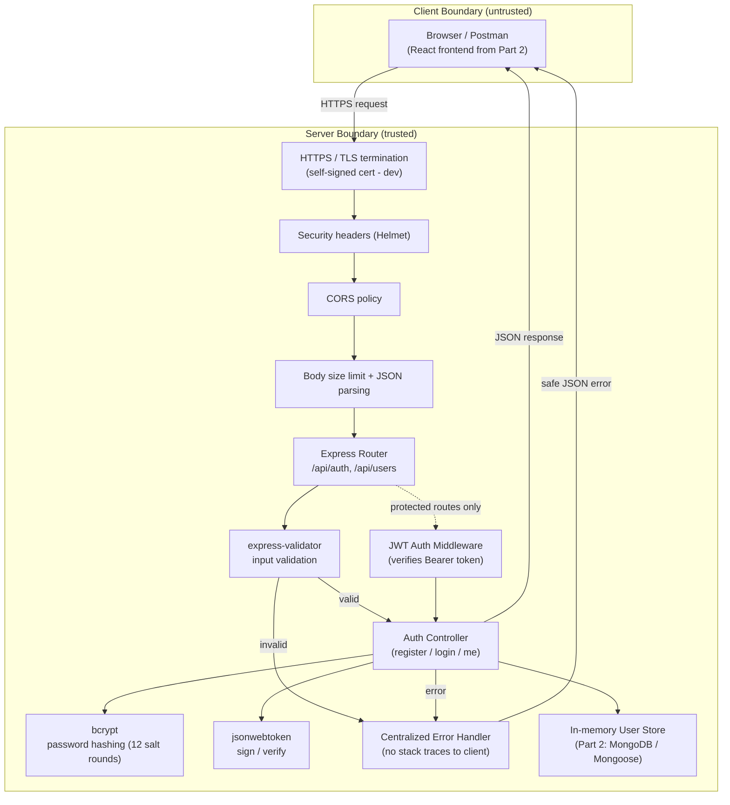

# HustleHub+ — Secure Freelance Marketplace Platform

**Module:** INSY7314/w & APDS7311/w
**Student:** Lonwabo Gumede (ST10270409)
**Part:** 1 — Secure Foundations

---

## 1. System Overview

HustleHub+ is a freelance marketplace that connects two primary types
of users:

- **Freelancers** — advertise services ("gigs"), manage bookings, and
  track income and estimated tax obligations.
- **Clients** — browse available gigs and book the services they need.

A third role, **Admin**, will oversee the platform in later parts of
the project (user/gig moderation). Because the platform will handle
credentials, booking/transaction records, and income data, security
has been treated as a first-class design constraint from Part 1
onward rather than something added on afterward.

This part of the POE delivers the **secure backend foundation**:
user registration and login, backed by password hashing and
JWT-based authentication, served exclusively over HTTPS, with
strict input validation and safe error handling. Gigs, bookings,
transactions, and the React frontend are introduced in Part 2; tax
estimation, CI/CD, Docker, and monitoring are introduced in Part 3.

## 2. Architecture

HustleHub+ follows the **MERN** stack (MongoDB, Express, React,
Node.js). In Part 1, the database layer is stubbed with an
in-memory store (as permitted by the brief) behind a data-access
module shaped like a Mongoose model, so it can be swapped for MongoDB
in Part 2 with minimal controller changes.



**Request flow for a protected route:**
`Client → HTTPS → Helmet/CORS → Router → Validation → JWT Auth
Middleware → Controller → Data Store → JSON Response`.
If validation or authentication fails, the request is short-circuited
before it ever reaches business logic or the data store.

### Component summary

| Layer | Technology | Responsibility |
|---|---|---|
| Transport | Node.js `https` module + self-signed cert | Encrypts all traffic between client and server |
| Security headers | `helmet` | Sets CSP, HSTS, X-Frame-Options, etc. |
| Input validation | `express-validator` | Rejects malformed/malicious input before it reaches controllers |
| Auth | `bcryptjs` + `jsonwebtoken` | Password hashing and stateless session identification |
| Routing | Express Router | Separates `/api/auth` (public) from `/api/users` (protected) |
| Data | In-memory store (→ MongoDB in Part 2) | Persists user records |
| Error handling | Centralized middleware | Returns safe, generic error responses |

## 3. Project Structure

```
hustlehub-backend/
├── certs/                  # Self-signed dev SSL cert (generated, not committed)
│   └── generate-cert.sh
├── postman/
│   └── HustleHub-Part1.postman_collection.json
├── src/
│   ├── config/
│   │   └── env.js          # Centralised env var loading + fail-fast checks
│   ├── controllers/
│   │   └── authController.js
│   ├── middleware/
│   │   ├── authenticate.js     # JWT verification
│   │   ├── errorHandler.js     # Centralised safe error responses
│   │   └── validateRequest.js  # express-validator result handling
│   ├── models/
│   │   └── userStore.js    # In-memory data access (Mongoose-shaped API)
│   ├── routes/
│   │   ├── authRoutes.js
│   │   └── userRoutes.js
│   ├── utils/
│   │   └── validators.js   # Registration/login validation rules
│   ├── app.js               # Express app + middleware pipeline
│   └── server.js            # HTTPS server bootstrap
├── .env.example
├── package.json
└── README.md
```

Routes, controllers, middleware, and data access are kept in
separate modules so each piece has a single responsibility and can
be tested or replaced independently (e.g. swapping `userStore.js`
for a Mongoose model in Part 2).

## 4. Security Decisions

### 4.1 Password Hashing
Passwords are never stored or logged in plain text. On registration,
`bcryptjs` hashes the password with **12 salt rounds** before it is
persisted — bcrypt's built-in per-password salt protects against
rainbow-table attacks, and the cost factor makes brute-forcing
computationally expensive even if the store is compromised. On
login, the submitted password is compared against the stored hash
using `bcrypt.compare`, which never re-exposes the plaintext.

### 4.2 JWT-Based Authentication
On successful registration or login, the server issues a signed JWT
containing only the user's `id` and `role` (no sensitive data) with
a 1-hour expiry. The token is returned to the client, which must
send it as a `Bearer` token in the `Authorization` header on
subsequent requests. The `authenticate` middleware verifies the
token's signature and expiry on **every** protected request
(`/api/users/me` in this part) using a secret loaded from an
environment variable — never hard-coded. Invalid, missing, expired,
or tampered tokens are all rejected with the same generic `401`
message, so an attacker cannot distinguish between failure reasons.

### 4.3 Input Validation
Every field accepted by `/api/auth/register` and `/api/auth/login`
is validated with `express-validator` before it reaches the
controller: emails must be well-formed, names are restricted to a
safe character set (blocking script/HTML injection attempts),
passwords must meet a minimum-strength policy, and roles are
restricted to an allow-list (`client`/`freelancer` only — `admin`
cannot be self-assigned at registration). Requests that fail
validation are rejected with a `400` and a structured list of field
errors; nothing is ever passed to `bcrypt` or the data store
unvalidated.

### 4.4 HTTPS
The API is served exclusively over HTTPS using a locally generated
self-signed certificate (`certs/generate-cert.sh`), via Node's
native `https` module. Even in a local/dev context, this
demonstrates the encryption of the transport layer, protecting
credentials and tokens in transit from network-level interception
(e.g. on shared Wi-Fi). In production this self-signed cert would
be replaced with one issued by a trusted CA (e.g. Let's Encrypt).
`helmet` also sets `Strict-Transport-Security` and other protective
headers on every response.

### 4.5 Safe Error Handling
A centralized error-handling middleware (`errorHandler.js`) catches
every error thrown in the request pipeline. The full error and stack
trace are logged **server-side only**; the client always receives a
generic, safe JSON message (e.g. `"An unexpected error occurred"`
for 500s) with no stack traces, file paths, or library internals.
A dedicated `notFound` handler returns a consistent `404` shape for
unmatched routes.

### 4.6 Additional hardening already in place
- `helmet()` sets standard protective security headers.
- Request body size is capped at `10kb` to reduce oversized-payload
  abuse.
- Generic, identical error messages are used for "email not found"
  vs "wrong password" on login, and for "invalid" vs "expired"
  tokens, to prevent user enumeration and information leakage.
- `.env` is excluded from version control; `JWT_SECRET` is loaded
  from the environment and the app fails fast on startup if it is
  missing.

*(Rate limiting and a full Content-Security-Policy configuration are
scoped to Part 2, once the frontend origin is known.)*

## 5. Setup & Running Locally

```bash
# 1. Install dependencies
npm install

# 2. Configure environment
cp .env.example .env
# Edit .env and set a strong JWT_SECRET, e.g.:
node -e "console.log(require('crypto').randomBytes(64).toString('hex'))"

# 3. Generate a local self-signed SSL certificate
npm run gen-cert

# 4. Start the server
npm start
# or, for auto-reload during development:
npm run dev
```

The API will be available at `https://localhost:5443`. Because the
certificate is self-signed, browsers/Postman/curl will show a
security warning — this is expected for local development; the
Postman collection has "SSL certificate verification" disabled for
this environment, and curl requires the `-k` flag.

## 6. API Endpoints (Part 1)

| Method | Endpoint | Auth required | Description |
|---|---|---|---|
| GET | `/api/health` | No | Health check |
| POST | `/api/auth/register` | No | Register a new user (`name`, `email`, `password`, optional `role`) |
| POST | `/api/auth/login` | No | Authenticate and receive a JWT |
| GET | `/api/users/me` | Yes (Bearer token) | Returns the authenticated user's profile — demonstrates JWT-protected route access |

## 7. Testing

A Postman collection is provided at
`postman/HustleHub-Part1.postman_collection.json`, covering:

- Successful registration
- Duplicate email registration (expects `409`)
- Registration with a weak password (expects `400`)
- Registration with an invalid email (expects `400`)
- Registration with a script/HTML injection attempt in `name` (expects `400`)
- Successful login (token is saved to a collection variable)
- Login with a wrong password (expects `401`)
- Login with an unknown email (expects `401`)
- Accessing `/api/users/me` with a valid token (expects `200`)
- Accessing `/api/users/me` with no token (expects `401`)
- Accessing `/api/users/me` with an invalid token (expects `401`)

Import the collection into Postman, ensure the server is running
locally, and disable SSL certificate verification (Settings →
General → "SSL certificate verification" → off) before running the
requests, since the dev certificate is self-signed.

## 8. Roadmap

- **Part 2:** MongoDB persistence, gig CRUD, bookings, transactions,
  income tracking, RBAC, React frontend, rate limiting, CSP, Newman
  + frontend tests.
- **Part 3:** Tax estimation, financial dashboard, CI/CD (GitHub
  Actions), static analysis, Docker/Docker Compose, structured
  logging, additional security features, final security review.

## AI Declaration

Generative AI (Anthropic Claude) was used to assist with parts of this submission, including:

- Drafting the initial Express/Node.js backend structure (routing, controllers, middleware)
- Explaining and implementing JWT authentication and bcrypt password hashing
- Drafting and refining the README documentation, including the architecture diagram
- Generating the Postman test collection and troubleshooting local environment setup (HTTPS certificate generation, environment variable configuration)

All AI-assisted output was reviewed, tested, and verified by the group before being included in this submission. The group takes full responsibility for the functionality, accuracy, and originality of the final work submitted, in accordance with the institution's Academic Integrity Policy.

### Troubleshooting (Windows / Git Bash)

- If `npm run gen-cert` reports a malformed subject name and `certs/cert.pem` is missing afterwards, Git Bash is rewriting the leading `/` in the `-subj` argument as a Windows path. Run it with path conversion disabled instead:
```bash
  MSYS_NO_PATHCONV=1 openssl req -x509 -nodes -days 365 -newkey rsa:2048 -keyout certs/key.pem -out certs/cert.pem -subj "/C=ZA/ST=KwaZulu-Natal/L=Durban/O=HustleHub/OU=Dev/CN=localhost"
```
- Confirm both files exist afterwards: `ls certs/`
- In PowerShell, `curl` is aliased to `Invoke-WebRequest`, which does not support the `-k` flag. Use `curl.exe` explicitly instead, e.g. `curl.exe -k https://localhost:5443/api/health`.
- If PowerShell mangles quotes in a JSON request body, write the JSON to a file first and send it with `-d "@file.json"` instead of an inline string.
